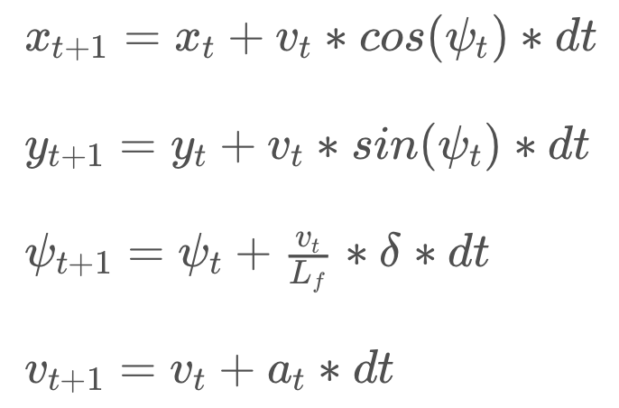

# CarND-Controls-MPC
Self-Driving Car Engineer Nanodegree Program

---

## Dependencies

* cmake >= 3.5
 * All OSes: [click here for installation instructions](https://cmake.org/install/)
* make >= 4.1
  * Linux: make is installed by default on most Linux distros
  * Mac: [install Xcode command line tools to get make](https://developer.apple.com/xcode/features/)
  * Windows: [Click here for installation instructions](http://gnuwin32.sourceforge.net/packages/make.htm)
* gcc/g++ >= 5.4
  * Linux: gcc / g++ is installed by default on most Linux distros
  * Mac: same deal as make - [install Xcode command line tools]((https://developer.apple.com/xcode/features/)
  * Windows: recommend using [MinGW](http://www.mingw.org/)
* [uWebSockets](https://github.com/uWebSockets/uWebSockets) == 0.14, but the master branch will probably work just fine
  * Follow the instructions in the [uWebSockets README](https://github.com/uWebSockets/uWebSockets/blob/master/README.md) to get setup for your platform. You can download the zip of the appropriate version from the [releases page](https://github.com/uWebSockets/uWebSockets/releases). Here's a link to the [v0.14 zip](https://github.com/uWebSockets/uWebSockets/archive/v0.14.0.zip).
  * If you have MacOS and have [Homebrew](https://brew.sh/) installed you can just run the ./install-mac.sh script to install this.
* [Ipopt](https://projects.coin-or.org/Ipopt)
  * Mac: `brew install ipopt --with-openblas`
  * Linux
    * You will need a version of Ipopt 3.12.1 or higher. The version available through `apt-get` is 3.11.x. If you can get that version to work great but if not there's a script `install_ipopt.sh` that will install Ipopt. You just need to download the source from the Ipopt [releases page](https://www.coin-or.org/download/source/Ipopt/) or the [Github releases](https://github.com/coin-or/Ipopt/releases) page.
    * Then call `install_ipopt.sh` with the source directory as the first argument, ex: `bash install_ipopt.sh Ipopt-3.12.1`. 
  * Windows: TODO. If you can use the Linux subsystem and follow the Linux instructions.
* [CppAD](https://www.coin-or.org/CppAD/)
  * Mac: `brew install cppad`
  * Linux `sudo apt-get install cppad` or equivalent.
  * Windows: TODO. If you can use the Linux subsystem and follow the Linux instructions.
* [Eigen](http://eigen.tuxfamily.org/index.php?title=Main_Page). This is already part of the repo so you shouldn't have to worry about it.
* Simulator. You can download these from the [releases tab](https://github.com/udacity/CarND-MPC-Project/releases).


## Basic Build Instructions


1. Clone this repo.
2. Make a build directory: `mkdir build && cd build`
3. Compile: `cmake .. && make`
4. Run it: `./mpc`.

## Tips

1. It's recommended to test the MPC on basic examples to see if your implementation behaves as desired. One possible example
is the vehicle starting offset of a straight line (reference). If the MPC implementation is correct, after some number of timesteps
(not too many) it should find and track the reference line.
2. The `lake_track_waypoints.csv` file has the waypoints of the lake track. You could use this to fit polynomials and points and see of how well your model tracks curve. NOTE: This file might be not completely in sync with the simulator so your solution should NOT depend on it.
3. For visualization this C++ [matplotlib wrapper](https://github.com/lava/matplotlib-cpp) could be helpful.

## Editor Settings

We've purposefully kept editor configuration files out of this repo in order to
keep it as simple and environment agnostic as possible. However, we recommend
using the following settings:

* indent using spaces
* set tab width to 2 spaces (keeps the matrices in source code aligned)

## Code Style

Please (do your best to) stick to [Google's C++ style guide](https://google.github.io/styleguide/cppguide.html).

## Project Instructions and Rubric

Note: regardless of the changes you make, your project must be buildable using
cmake and make!

More information is only accessible by people who are already enrolled in Term 2
of CarND. If you are enrolled, see [the project page](https://classroom.udacity.com/nanodegrees/nd013/parts/40f38239-66b6-46ec-ae68-03afd8a601c8/modules/f1820894-8322-4bb3-81aa-b26b3c6dcbaf/lessons/b1ff3be0-c904-438e-aad3-2b5379f0e0c3/concepts/1a2255a0-e23c-44cf-8d41-39b8a3c8264a)
for instructions and the project rubric.

## Model

Bicycle Kinematic Model is used.


The upper and lower limits of steering angle are set to -25 and 25 degree.

Here is the MPC algorithm:

*Setup:

1. Define the length of the trajectory, N, and duration of each timestep, dt.
2. Define vehicle dynamics and actuator limitations along with other constraints.
3. Define the cost function.

*Loop:

1. We pass the current state as the initial state to the model predictive controller.
2. We call the optimization solver. Given the initial state, the solver will return the vector of control inputs that minimizes the cost function. The solver we'll use is called Ipopt.
3. We apply the first control input to the vehicle.
4. Back to 1.

In a real car, an actuation command won't execute instantly - there will be a delay as the command propagates through the system. A realistic delay might be on the order of 100 milliseconds.

This is a problem called "latency", and it's a difficult challenge for some controllers - like a PID controller - to overcome. But a Model Predictive Controller can adapt quite well because we can model this latency in the system.

## Tuning MPC
N is set to 10 and dt is set to 0.1

Define the components of the cost function:
```
    // The part of the cost based on the reference state.
    for (int i = 0; i < N; i++) {
      fg[0] += 1500*CppAD::pow(vars[cte_start + i] - ref_cte, 2);
      fg[0] += 1200*CppAD::pow(vars[epsi_start + i] - ref_epsi, 2);
      fg[0] += CppAD::pow(vars[v_start + i] - ref_v, 2);
    }

    // Reference State Cost
    // Minimize the use of actuators.
    for (int i = 0; i < N - 1; i++) {
      fg[0] += 1*CppAD::pow(vars[delta_start + i], 2);
      fg[0] += 1*CppAD::pow(vars[a_start + i], 2);
    }

    // TODO: Define the cost related the reference state and
    // any anything you think may be beneficial.
    // Minimize the value gap between sequential actuations.
    for (int i = 0; i < N - 2; i++) {
      fg[0] += 5*CppAD::pow(vars[delta_start + i + 1] - vars[delta_start + i], 2);
      fg[0] += 1*CppAD::pow(vars[a_start + i + 1] - vars[a_start + i], 2);
    }
```

## Call for IDE Profiles Pull Requests

Help your fellow students!

We decided to create Makefiles with cmake to keep this project as platform
agnostic as possible. Similarly, we omitted IDE profiles in order to we ensure
that students don't feel pressured to use one IDE or another.

However! I'd love to help people get up and running with their IDEs of choice.
If you've created a profile for an IDE that you think other students would
appreciate, we'd love to have you add the requisite profile files and
instructions to ide_profiles/. For example if you wanted to add a VS Code
profile, you'd add:

* /ide_profiles/vscode/.vscode
* /ide_profiles/vscode/README.md

The README should explain what the profile does, how to take advantage of it,
and how to install it.

Frankly, I've never been involved in a project with multiple IDE profiles
before. I believe the best way to handle this would be to keep them out of the
repo root to avoid clutter. My expectation is that most profiles will include
instructions to copy files to a new location to get picked up by the IDE, but
that's just a guess.

One last note here: regardless of the IDE used, every submitted project must
still be compilable with cmake and make./
